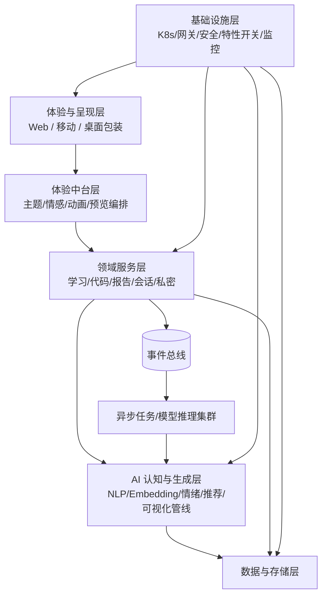
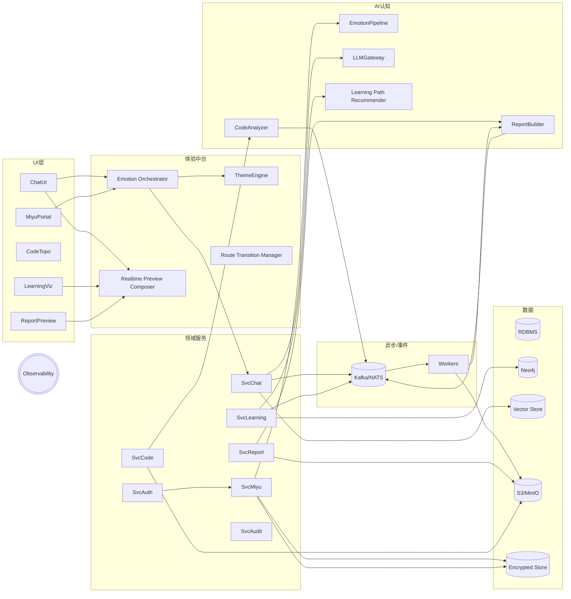
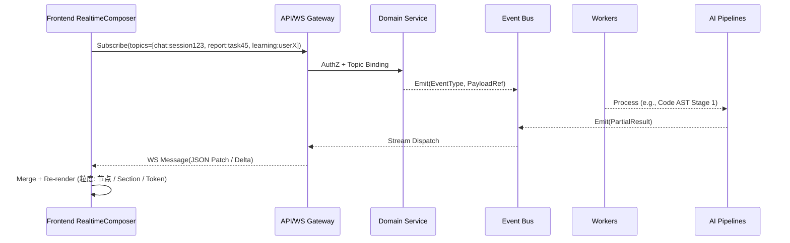
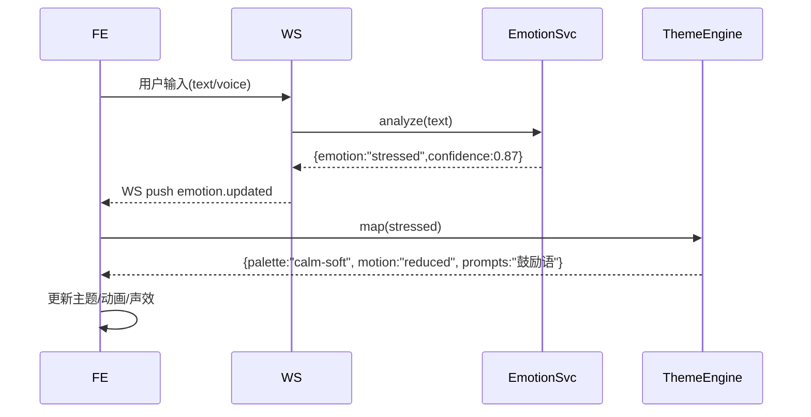

# YYC³ EasyVizAI 项目核心架构设计  
（版本：v1.0 - Draft）

> 目标：支撑“情感驱动 + 自适应学习 + 代码可视化 + 多模态报告 + 透明无感跳转 + 觅语私密空间 + 时时预览（实时渲染/流式反馈）”的一体化可视化智能应用平台。

---

## 1. 架构设计目标

| 维度 | 目标 |
|------|------|
| 用户体验 | 毫秒级输入反馈 / 流式生成 / 动画平滑 / 低认知负担 |
| 情感与陪伴 | 情绪识别 → UI/主题/语气/声效动态适配 |
| 私密安全 | 觅语层物理 & 逻辑隔离；端到端加密；最小可见性 |
| 扩展性 | 模块化服务边界；插件式 AI Pipeline；特性灰度发布 |
| 实时预览 | 学习路径、代码拓扑、报告段落、情绪曲线、渲染进度逐帧或分块流式更新 |
| 多模态 | 文本 / 图形 / 音效 / 动画 / 表情 / Lottie / SVG / 语音 |
| 合规 | 数据分级、留存策略、可审计访问；隐私自毁策略 |
| 可运维 | Observability 一站式：日志、指标、链路、事件时间线 |
| 性能 | 典型复杂交互 P95 < 800ms；流式首包 < 150ms |

---

## 2. 分层总体架构



### 层次说明  
1. 体验与呈现层：前端 / WebSocket / 富动画 / 声效引擎 / 实时预览合成。  
2. 体验中台层（Experience Orchestrator）：情感状态驱动主题、动画、提示语；“透明无感跳跃”路由 Transition；实时预览合并（多数据源 → 渲染队列）。  
3. 领域服务层：会话、学习路径、代码解析、报告生成、私密空间、权限与审计。  
4. AI 认知层：统一 Prompt 模板、模型选择策略、情绪分类、推荐引擎、AST→图谱、报告合成 Pipeline。  
5. 数据与存储：关系型（业务）、图数据库（学习依赖）、对象存储（报告/动画/媒资）、向量库（语义检索）、加密仓（私密/情感）。  
6. 基础设施：API Gateway、身份认证、二次认证、KMS、消息队列、特性开关、监控链路、CI/CD。  

---

## 3. 关键功能子系统结构



---

## 4. “时时预览”实时构建与分层

| 场景 | 数据源 | 推送方式 | 前端合成策略 | 体验输出 |
|------|--------|----------|--------------|----------|
| 聊天流式 | LLM Gateway | SSE / WebSocket | 增量 Token 拼接 + 情感标签插桩 | 行内高亮 / 主题动态 |
| 学习路径更新 | RecoEngine → SvcLearning | 事件总线 → WS | Diff 合并（节点局部重绘） | 动态节点解锁动画 |
| 代码可视化 | CodeAnalyzer 分阶段 | 任务状态轮询 + WS | 初始骨架 + 子图增量插入 | 渐显调用拓扑 |
| 报告生成 | ReportBuilder Pipeline | 分段 artifact 通知 | Section 占位符 → 实时替换 | 逐段渲染 + 进度条 |
| 情绪曲线 | EmotionPipeline | 节流推送 | 时间序列缓存+平滑曲线 | 情感仪表 / 背景微调 |
| 私密空间日记加密 | 本地→加密接口 | Ack + 状态推送 | 乐观 UI + 回滚策略 | 无闪烁保存反馈 |

### 实时预览通道模型



---

## 5. 主要服务边界与职责

| 服务 | 职责 | 不做的事 |
|------|------|----------|
| SvcAuth | 登录、二次认证、私密层许可、Token 策略 | 业务会话逻辑 |
| SvcMiyu | 私密会话、日记、情感舒压工具、数据留存策略 | 公共推荐 / 广场分发 |
| SvcChat | 公共/普通会话、模型路由、上下文裁剪 | 私密数据存储 |
| SvcLearning | 知识图谱、节点进度、路径 Diff | 大模型内容生成 |
| SvcCode | 代码解析任务投递、AST 拆分、拓扑输出 | 语言执行沙箱 |
| SvcReport | 报告任务编排、Section Template、Artifact 管理 | 渲染端 UI |
| EmotionPipeline | 情感分类、标签裁剪、匿名聚合 | 用户原文持久化 |
| RecoEngine | 学习路径推荐、难度调优 | 内容渲染 |
| ReportBuilder | 合成多模态 Section | 业务授权 |
| LLMGateway | 模型抽象路由（OpenAI / 本地 / 混合） | 业务状态管理 |
| FeatureFlag | 灰度、A/B、策略决策 | 鉴权 |

---

## 6. 数据模型（高层概览）

| 实体 | 关键字段 | 隐私级别 | 备注 |
|------|----------|----------|------|
| User | id, roles, miyu_flag | 中 | - |
| PrivateSpace | user_id, key_ref | 高 | 独立加密 |
| MiyuEntry | ps_id, type(entry/chat/diary), cipher_blob | 高 | 加密后存储 |
| EmotionLog | user_id, label, confidence, ts | 中(脱敏) | 不含原文 |
| LearningNode | id, prereq[], metadata | 低 | 图结构 |
| LearningProgress | user_id, node_id, status | 中 | 与推荐耦合 |
| CodeArtifact | hash, graph_json, stage, created_at | 中 | 可缓存 |
| ReportTask | id, user_id, status, sections[], policy | 中 | 分段生成 |
| ReportArtifact | task_id, section_id, type, url | 中 | 对象存储 |
| ChatMessage | session_id, role, content(可部分加密) | 中 | 视场景策略 |
| FeatureFlagEval | user_id, flag_id, variant | 低 | 灰度分析 |

---

## 7. 技术栈与关键选型

| 模块 | 推荐 |
|------|------|
| 后端框架 | Django / Django REST Framework + Channels(WS) |
| 异步/队列 | Celery + Redis / RabbitMQ；重任务分独立队列 |
| 模型服务 | FastAPI 微服务（LLM Gateway / Emotion）|
| 图数据库 | Neo4j（学习路径） |
| 向量检索 | Qdrant / Weaviate / Milvus |
| 对象存储 | MinIO / S3 |
| 加密 | KMS（Hashicorp Vault / cloud KMS）+ AES-GCM Envelope |
| 实时推送 | WebSocket（Channels）+ SSE（兼容降级） |
| 前端 | React + Vite + TypeScript + Framer Motion + React Flow |
| 动画 & 多模态 | Lottie, SVG 动画编排, Howler.js 声效 |
| Observability | OpenTelemetry + Prometheus + Grafana + Loki + Jaeger |
| Auth | JWT (短期) + Refresh + WebAuthn / TOTP（二次认证） |
| Feature Flag | OpenFeature SDK / 自建数据源 |

---

## 8. 事件驱动与扩展点

### 关键事件主题（Topic）
- emotion.updated
- miyu.entry.created
- chat.message.stream
- learning.node.completed
- learning.path.recommended
- code.analysis.stage_progress
- report.task.progress
- report.section.ready
- security.miyu.access
- feature.flag.evaluated

### 事件 Payload 规范
```json
{
  "id": "uuid",
  "ts": 1735345345,
  "type": "report.section.ready",
  "actor": "user:123",
  "data": {
    "task_id": "rpt_456",
    "section_id": "intro",
    "url": "s3://.../intro.json"
  },
  "trace_id": "otel-...."
}
```

---

## 9. 情感驱动主题管线 (Emotion → UI)



映射策略（示例）：
| Emotion | 主题调性 | 动画强度 | 声效 | UI 提示 |
|---------|----------|----------|------|---------|
| calm | default | normal | ambient_soft | 正常建议 |
| focus | high-contrast | crisp | subtle_tick | 集中模式 |
| stressed | soft-desaturated | reduced | warm_pad | 呼吸/放松 |
| encouraged | vibrant | dynamic | sparkle | 鼓励语/成就 |

---

## 10. 安全 & 合规策略

| 控制域 | 措施 |
|--------|------|
| 私密层隔离 | 独立表前缀 + 加密字段 + 访问审计 |
| 二次认证 | 进入觅语层 / 恢复会话需 TOTP/WebAuthn |
| 加密 | 字段级（内容）+ 文件级（对象存储 KMS） |
| 日志 | 不记录私密明文，情绪日志脱敏 |
| 数据留存 | Miyu 内容可配置 7/30/90/永久 + 可自毁 |
| 模型调用 | Prompt Redaction（去除真实姓名/敏感段） |
| 滥用检测 | 事件流上配置规则（频率/异常模式） |
| 访问控制 | RBAC + ABAC（环境/层级/特性开关） |
| 隐私声明 | docs/compliance/ 下策略公开 |

---

## 11. 性能与伸缩策略

| 组件 | 伸缩方式 |
|------|----------|
| LLM Gateway | 水平扩容 / 连接池 / 请求限流 |
| Emotion Pipeline | Batch + 低延迟模型（ONNX Runtime） |
| Report Builder | 分段并行（图形→文本→合成），队列优先级 |
| Code Analyzer | 语言隔离容器（安全沙箱），哈希缓存 |
| Realtime Composer | 前端内存 diff + 虚拟化渲染 |
| GraphDB | 读写分离 / 热节点预加载 |
| WebSocket | 分层节点（Gateway 边车 + 内部事件桥） |

首包策略：
- 预加载 design tokens / 核心 Lottie / 声效 manifest
- Emotion 初始状态懒加载后再细调

---

## 12. Observability (四象限)

| 维度 | 工具 | 指标示例 |
|------|------|----------|
| 指标 Metrics | Prometheus | ws_active_connections / emotion_infer_latency_ms / report_stage_duration_sum |
| 日志 Logs | Loki / Structured JSON | event_type / user_hash / layer / trace_id |
| 链路 Tracing | OpenTelemetry + Jaeger | chat→emotion→theme chain |
| 事件审计 Timeline | 自建事件查询 API | 用户私密访问、自动删除任务 |

---

## 13. Feature Flag & A/B

| Flag | 作用 | 变体 |
|------|------|------|
| miyu.layer.enabled | 控制是否展示入口 | on / off |
| report.streaming | 报告段落流式 | v1 / v2 |
| emotion.theme.mapping | 不同情感主题映射策略 | classic / gentle |
| code.graph.layout | 拓扑布局算法 | dagre / force |
| learning.reco.v | 推荐算法版本 | baseline / embedding_v2 |

SDK：前端缓存 5 分钟 / 后端评估策略注入。

---

## 14. 目录结构补充（共识版）

```
backend/
  app/
    api/v1/{public,miyu,report,code,learning,auth}
    core/{events,tasks,ai,privacy}
    instrumentation/{logging,metrics,tracing}
    feature_flags/
    websocket/
  worker/
frontend/
  src/
    design-system/{tokens,themes,animation,sound}
    modules/{chat,miyu,learning,code,report}
    context/{Emotion,FeatureFlag,Privacy}
    services/{api,ws,analytics}
    assets/{lottie,svg,sounds}
docs/
  architecture/{core_architecture.md,realtime_pipeline.md}
  compliance/{privacy_policy.md,data_retention.md}
  ai/{emotion_pipeline.md,learning_path_algo.md}
```

---

## 15. JSON Contract（示例片段）

情感推送：
```json
{
  "channel": "emotion.updated",
  "payload": {
    "emotion": "stressed",
    "confidence": 0.87,
    "ts": 1735345345
  }
}
```

报告进度：
```json
{
  "channel": "report.task.progress",
  "payload": {
    "task_id": "rpt_456",
    "stage": "section_ready",
    "section_id": "intro",
    "progress": 0.35
  }
}
```

---

## 16. 实施路线（压缩版）

| 阶段 | 里程碑 | 关键交付 |
|------|--------|----------|
| Phase 0 | 骨架搭建 | API Gateway / WS 通道 / Emotion Mock / Design Tokens |
| Phase 1 | 核心功能闭环 | Chat 流式 + Learning 基本图 + Miyu 私密认证 |
| Phase 2 | 增强智能 | 推荐引擎 / 报告分段 / 代码拓扑 / 情感主题联动 |
| Phase 3 | 私密 & 合规 | 加密 + 数据留存 + 审计事件 + 风险策略 |
| Phase 4 | 体验精炼 | 动画体系 / 声效 / 无感跳转 / A/B 策略 |
| Phase 5 | 性能与规模 | 模型路由优化 / 缓存层 / 指标与扩容策略 |

---

## 17. 风险与缓解

| 风险 | 说明 | 缓解 |
|------|------|------|
| 情绪误判 | 低置信导致 UI 频繁震荡 | 设置信心阈值 + 滤波窗口 |
| 私密泄漏担忧 | 用户不信任“绝对私密” | 透明策略 + 本地端到端加密说明 |
| WS 风暴 | 高频事件导致前端渲染抖动 | 聚合节流 + JSON Patch 合并 |
| 报告长耗时 | 多模态生成串行 | 分段并行 + 进度回溯策略 |
| 代码分析 CPU 峰值 | 大文件解析耗时 | 任务分阶段 + 超时限制 + 结果缓存 |
| Feature Flag 偏差 | 实验未隔离 | 事件埋点 + 统一分析维度 |

---

## 18. 未来扩展展望

| 方向 | 可能能力 |
|------|----------|
| 多智能体 | 协同学习评估 / 角色式代码审查 |
| 本地模型 | 隐私增强离线模式（Miyu） |
| XR/空间可视化 | 学习路径 3D 化 / 代码动态空间映射 |
| 心理健康 API | 合作专业资源，紧急响应模式 |
| 自动化知识内化 | 用户私密内容 → 个人语义记忆（可控显隐） |

---

## 19. 附录：设计 Token 示例（简化）

```json
{
  "color": {
    "ink": "#1A3E5E",
    "cloud": "#4A90E2",
    "jade": "#F7F9FA",
    "emotion": {
      "stressed_bg": "#0F2942",
      "encouraged_accent": "#7FB5FF"
    }
  },
  "motion": {
    "durations": { "fast": 120, "base": 240, "slow": 400 },
    "easing": { "standard": "cubic-bezier(0.4,0,0.2,1)" }
  },
  "sound": {
    "enter": "welcome.mp3",
    "section_ready": "soft_ding.mp3",
    "emotion_shift": "breath_pad.mp3"
  }
}
```

---

## 20. 总结

该核心架构通过“体验中台 + 领域服务分离 + AI 管线解耦 + 事件驱动实时预览”实现多模态与情感驱动闭环，并以私密空间合规与可观测性为基石，形成可持续扩展的可视化智能平台。后续可在此基础上开展更细的 OpenAPI 合同、数据字典与安全威胁建模。

> 需要生成：OpenAPI 草案、事件主题 schema、Report Pipeline 时序图、Emotion 置信滤波算法细化，请继续指示。
