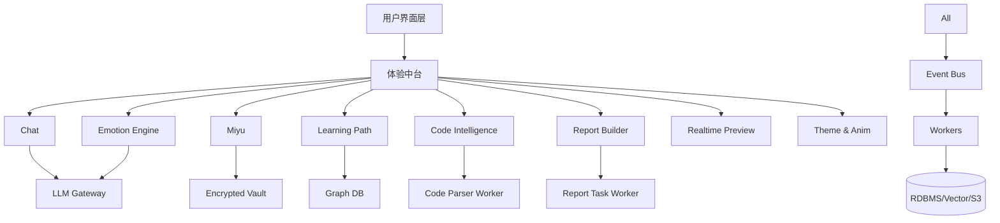
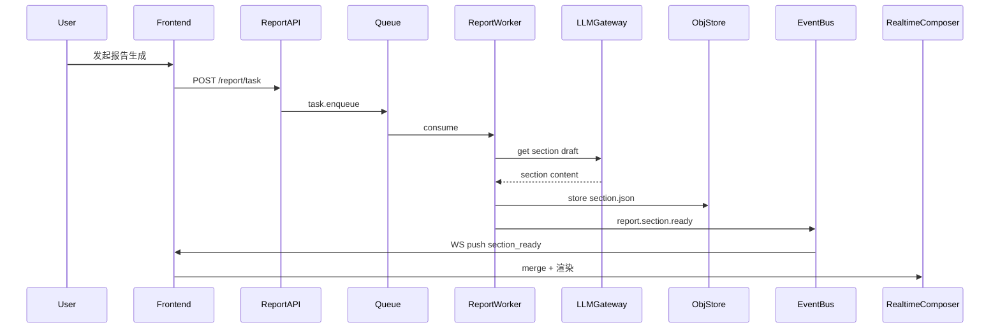
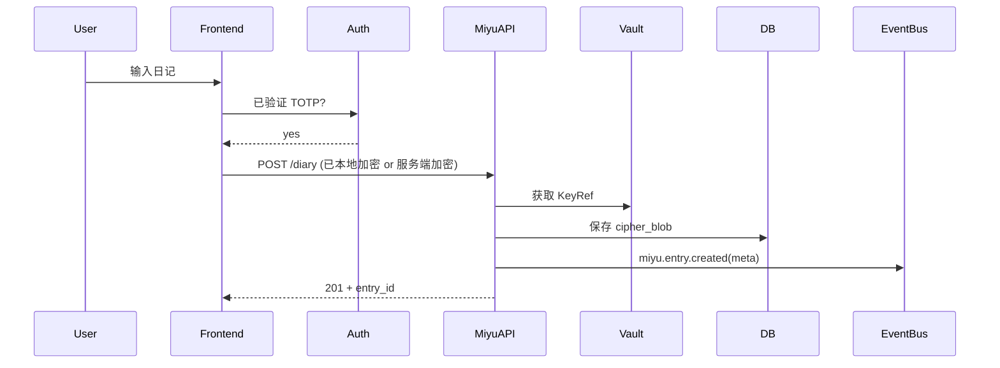

# YYC³ EasyVizAI 项目功能模块设计文档（完整版指导稿）

版本: v1.0 (Draft)  
作者: （待填写）  
更新日期: （自动化CI可插入）  

> 本文档对 YYC³ EasyVizAI 平台的核心/扩展功能模块进行系统化定义，覆盖：用户角色、功能拆分、模块边界、核心流程、接口草案、数据模型、状态机、交互/实时预览、私密“觅语”层、情感与多模态、合规安全、性能指标、实施路线与里程碑。  
> 可作为：产品规划 + 研发对齐 + 架构实施 + 测试验收 + 合规审查的统一蓝本。  

---

## 目录

1. 总览与核心价值
2. 用户角色与权限矩阵
3. 功能模块一览（结构图）
4. 模块分解（详细规格）
   - 4.1 通用会话 & 智能交互模块 (Chat)
   - 4.2 觅语（Miyu）私密空间
   - 4.3 情感引擎 (Emotion Engine)
   - 4.4 自适应学习路径 (Learning Path)
   - 4.5 代码可视化与解析 (Code Intelligence)
   - 4.6 多模态报告生成 (Report Builder)
   - 4.7 实时预览编排 (Realtime Preview Orchestrator)
   - 4.8 主题 / 动画 / 声效系统 (Experience & Theme)
   - 4.9 鉴权与账户安全 (Auth & Security)
   - 4.10 数据隐私 & 合规管理 (Privacy & Compliance)
   - 4.11 特性开关与实验 (Feature Flags & A/B)
   - 4.12 可观测性与运维 (Observability & Ops)
   - 4.13 管理控制台 (Admin Console)
   - 4.14 资源与文件管理 (Assets & Storage)
   - 4.15 国际化与可访问性 (i18n & Accessibility)
   - 4.16 支付/许可（可选未来）
5. 事件体系 & 流水线
6. 数据模型概览（ER/分类）
7. 核心流程时序图
8. API 草案与命名约定
9. 状态机定义（任务/报告/代码解析/学习节点/情绪）
10. 关键非功能需求 (NFR)
11. 性能 & SLA 指标
12. 安全威胁模型简要
13. 日志与审计策略
14. 数据留存 & 销毁策略
15. 设计 Token 与前端集成策略
16. 测试策略 (Test Strategy)
17. 实施阶段路线图
18. 风险列表 & 缓解
19. 指标与KPI
20. 附录（术语 & 约定）

---

## 1. 总览与核心价值

- 整合“智能对话 + 学习路径 + 代码解析 + 多模态报告 + 情绪驱动 UI + 私密心理陪伴”。
- 提供差异化核心：  
  1) 情感感知动态体验  
  2) 觅语私密层（绝对隐私向 + 舒压）  
  3) 实时预览（流式/增量）  
  4) 多模态输出（文本/图形/动画/声音）  
  5) 可扩展 AI 管线（插件化）  

---

## 2. 用户角色与权限矩阵 (简版)

| 角色 | 描述 | 核心权限 | 限制 |
|------|------|----------|------|
| 游客 Guest | 未登录/试用 | 公共演示/只读 | 不可进觅语 / 不存档 |
| 注册用户 User | 标准 | Chat / 基础学习 / 报告简版 | 高级功能需Flag或付费 |
| 高级用户 Pro | 付费或授权 | 全部基础 + 高级报告/代码分析 + 觅语 | API限频更高 |
| 管理员 Admin | 运营管理 | 用户管理/Flag配置/审计查看 | 不可查看觅语明文 |
| 审计/合规 Auditor | 法务/风控 | 访问加密元信息/操作日志 | 不得解密原文 |
| 系统/服务 Service | 机器账号 | 内部事件/任务消费 | 无交互UI |

---

## 3. 功能模块一览（结构图）



---

## 4. 模块分解（详细规格）

### 4.1 通用会话 & 智能交互模块 (Chat)

- 功能点：
  - 流式补全（SSE/WS）
  - 上下文管理（窗口裁剪/语义压缩）
  - 工具调用（学习节点查询 / 代码解析触发 / 报告生成起始）
  - 模型选择（GPT / 本地 / 混合策略）
  - 会话标签（主题 / 关联学习路径 / 情感快照）
- 输入支持：文本 / 语音转文本（后端 ASR 接口）
- 数据持久：ChatSession, ChatMessage（部分字段可加密）
- 接口草案：
  - POST /api/v1/chat/session
  - POST /api/v1/chat/{session_id}/message  (支持 stream=true)
  - GET  /api/v1/chat/{session_id}/history?after=...
- 验收要点：
  - 流式首包 < 150ms（缓存 + 预占位）
  - 支持 Emotion 更新插槽（每N tokens 触发分析）

### 4.2 觅语（Miyu）私密空间

- 定位：绝对私密心情/日记/舒压/陪伴
- 功能：
  - 二次认证（TOTP / WebAuthn）
  - 日记多模态：文本|语音|图片（加密后存储）
  - 情感陪伴对话（缓存情绪轨迹）
  - 舒压工具（冥想引导/呼吸动画/正念脚本/小游戏占位）
  - 自毁策略：可配置 7/30/90/永久；手动立即销毁
- 不做：群组公共广播 / 分享 / 非合规内容允许
- 接口草案：
  - POST /api/v1/miyu/auth/verify-2fa
  - POST /api/v1/miyu/diary
  - GET  /api/v1/miyu/diary?from=&to=
  - DELETE /api/v1/miyu/diary/{id}
  - POST /api/v1/miyu/tools/relax-breath/start
- 数据规范：MiyuEntry.cipher_blob；EmotionLog(脱敏)
- UI 主题：柔和、低饱和、动画减速
- 合规：管理员不可解密；审计仅元数据

### 4.3 情感引擎 (Emotion Engine)

- 目标：低延迟情感标签 + 稳定 UI 映射 + 私密隔离
- 管线：
  1. 文本预处理（去敏/截短）
  2. 模型推理（ONNX Runtime / Distil 模型）
  3. 置信度滤波（Exponentially Weighted + 最小变化阈值）
  4. 输出标签：calm / focus / stressed / encouraged / neutral
  5. 主题 & 声效触发
- 接口：
  - POST /internal/emotion/analyze (批量)
  - WS emotion.updated
- 日志：
  - 仅 emotion + confidence + hash(source snippet)

### 4.4 自适应学习路径 (Learning Path)

- 功能：
  - 知识图谱（节点 + 前置依赖 + 难度 + 标签）
  - 用户进度（active / completed / locked）
  - 推荐算法：规则初版 → 嵌入相似度/掌握度评分升级
  - 节点内容：标题 + 描述 + 关联资源 + 推荐练习
  - 动态 Diff 推送：节点解锁事件
- 接口：
  - GET /api/v1/learning/graph
  - GET /api/v1/learning/progress
  - POST /api/v1/learning/node/{id}/complete
  - GET /api/v1/learning/recommendations
- 数据：
  - LearningNode(id, prerequisites[])
  - LearningProgress(user_id, status)
- 实时：
  - learning.node.completed
  - learning.path.recommended

### 4.5 代码可视化与解析 (Code Intelligence)

- 功能：
  - 代码上传 / 片段分析
  - AST 构建 / 依赖关系 / 调用图 / 控制流基础
  - 可视化输出 JSON → 前端 react-flow/cytoscape 渲染
  - 阶段式：预扫描 → AST → Graph Layout → 注释解释
  - 结果缓存：hash(code + lang)
- 接口：
  - POST /api/v1/code/analyze (async=true)
  - GET  /api/v1/code/task/{id}/status
  - GET  /api/v1/code/task/{id}/graph
- 事件：
  - code.analysis.stage_progress
  - code.analysis.completed
- 安全：
  - 禁止执行；仅静态解析
  - 语言白名单

### 4.6 多模态报告生成 (Report Builder)

- 功能：
  - 模板驱动（Template DSL：section type, data bindings）
  - 分段生成：结构 → 文本 → 图形 → 音效/动画引用
  - 流式预览：每个 Section Ready 推送
  - 导出：HTML / PDF / JSON 元数据
  - 压缩：静态资源打包
- 状态机：
  - pending → building → section_ready(n) → assembling → done / failed
- 接口：
  - POST /api/v1/report/task
  - GET  /api/v1/report/task/{id}/status
  - GET  /api/v1/report/task/{id}/sections
  - GET  /api/v1/report/task/{id}/artifact
- 事件：
  - report.task.progress
  - report.section.ready

### 4.7 实时预览编排 (Realtime Preview Orchestrator)

- 职责：
  - 多通道订阅聚合（chat / report / learning / code / emotion）
  - Delta 合并：JSON Patch / Section Replace
  - 节流策略：情绪更新最小间隔 / Graph diff 局部更新
  - 失败回退：断线重播 Replay Window
- 协议：
  - WebSocket topics = {chat:session_x, report:task_y, learning:user_z}
- 客户端：
  - RealtimeComposer → 分发到具体组件渲染器

### 4.8 主题 / 动画 / 声效系统 (Experience & Theme)

- 目标：统一体验 Token 化 → Emotion / Context 动态映射
- 组成：
  - Design Tokens(color/motion/sound/typography)
  - ThemeEngine(emotion→palette, motion intensity)
  - Animation Layer(Lottie/SVG + Framer Motion)
  - Sound Engine(Howler.js + policy: reduce-motion triggers mute)
- Emotion 联动策略：
  - stressed → 减少闪烁/柔和音效
  - encouraged → 增添光晕/鼓励音
- 前端 Hook：
  - useEmotionTheme()
  - useRealtimeSoundCue(event)

### 4.9 鉴权与账户安全 (Auth & Security)

- 认证：
  - 登录：JWT access + refresh
  - 私密层：二次认证 (TOTP / WebAuthn)
- 授权：
  - RBAC + FeatureFlag (Pro / Beta Access)
  - ABAC：用户层级 + 请求上下文（私密层, device fingerprint）
- 签名：
  - 请求签名（可选内部服务）
- 风险控制：
  - 频次限制 (Chat/Analyze/Report)
  - 异常检测（登录地域突变）

### 4.10 数据隐私 & 合规管理 (Privacy & Compliance)

- 分级：
  - 公开：学习节点图谱
  - 受限：普通聊天消息（可审计）
  - 高敏：Miyu 日记 / 心理标签（端到端加密字段 + Vault KeyRef）
- 功能：
  - 数据留存配置
  - 自动销毁任务
  - 用户导出/删除
- 不记录：Miyu 原文日志
- 审计：
  - metadata only：访问时间 / 动作 / 结果

### 4.11 特性开关与实验 (Feature Flags & A/B)

- 用途：灰度，实验不同情感主题映射
- 模型：
  - flag_id, variants, targeting rules
- 前端缓存：5 分钟
- 事件：
  - feature.flag.evaluated

### 4.12 可观测性与运维 (Observability & Ops)

- 指标：
  - emotion_infer_latency_ms
  - report_section_avg_time
  - ws_active_connections
  - miyu_auth_totp_fail_count
- 日志：结构化 JSON + trace_id
- 链路：OTel (Chat → Emotion → Theme)
- 告警：P95 过阈值 / 队列积压 / 错误率

### 4.13 管理控制台 (Admin Console)

- 功能：
  - 用户/角色管理
  - Flag 配置
  - 报告任务监控
  - 异步队列健康
  - 学习路径节点管理（图编辑）
  - 不含 Miyu 明文
- 提示：操作留审计日志

### 4.14 资源与文件管理 (Assets & Storage)

- 存储分类：
  - /reports/{task_id}/section_x.json
  - /code/{hash}/graph.json
  - /miyu/{user_id}/encrypted_blob.dat
  - /animations/lottie/*.json
  - /sounds/*.mp3
- 策略：
  - 版本化
  - CDN 缓存（公共资源）
  - 私密资源强鉴权（临时链接）

### 4.15 国际化与可访问性 (i18n & Accessibility)

- i18n：
  - JSON 资源按命名空间：common/chat/learning/miyu
  - 未来多语言情感映射 → 语言中性标签
- 无障碍：
  - 动画强度可控
  - 颜色对比 > WCAG AA
  - 语音朗读支持

### 4.16 支付/许可（未来）

- 订阅等级：Basic / Pro / Enterprise
- 接口占位：
  - GET /api/v1/billing/plan
  - POST /api/v1/billing/subscribe
- 使用额度：调用 Token / 任务数 / 存储限额

---

## 5. 事件体系 & 流水线（核心主题）

| Topic | 触发源 | 数据要点 | 消费者 |
|-------|--------|----------|--------|
| chat.message.stream | Chat Svc | token, index | 前端 / Emotion |
| emotion.updated | Emotion Pipeline | emotion, confidence | ThemeEngine |
| learning.node.completed | Learning Svc | node_id | RecoEngine / 前端 |
| learning.path.recommended | RecoEngine | diff[] | 前端 |
| code.analysis.stage_progress | Code Worker | stage, percent | 前端 |
| report.section.ready | Report Worker | section_id, url | 前端预览 |
| miyu.entry.created | Miyu Svc | entry_meta | 审计(脱敏) |
| feature.flag.evaluated | FF Service | flag, variant | 分析 |
| security.miyu.access | Auth | success/fail | 审计 |
| data.retention.cleanup | Retention Job | count | 运维 |

---

## 6. 数据模型概览（分类）

| 类别 | 表/集合 | 说明 |
|------|--------|------|
| 用户 | User, UserProfile | 基础 & 偏好 |
| 权限 | Role, FeatureFlagEval | RBAC / Flag 决策 |
| 会话 | ChatSession, ChatMessage | 普通对话 |
| 私密 | PrivateSpace, MiyuEntry, EmotionLog | 加密 & 脱敏 |
| 学习 | LearningNode, LearningProgress | 图谱/进度 |
| 代码 | CodeTask, CodeArtifact | 阶段 & 结果 |
| 报告 | ReportTask, ReportSection, ReportArtifact | 多段生成 |
| 事件 | EventLog (可选) | 审计/对账 |
| 实验 | Experiment, VariantMetric | A/B 分析 |
| 配置 | SystemConfig, ThemeMap | 动态配置 |

---

## 7. 核心流程时序（示例）

### 7.1 报告分段实时预览



### 7.2 Miyu 日记保存



---

## 8. API 草案命名约定

- REST 前缀：/api/v1/
- 资源名：小写-短横线或下划线
- 动作型情况：/resource/{id}/action
- 异步：返回 {task_id}，轮询或订阅 WS
- 错误格式：

```json
{ "error": { "code": "INVALID_PARAM", "message": "xxx", "trace_id": "..." } }
```

---

## 9. 状态机定义（摘取）

### 9.1 报告任务

pending → building → section_partial (repeat) → assembling → done  
失败路径：任何阶段 → failed (error_code)

### 9.2 代码分析

queued → scanning → ast_build → graph_layout → enriching → done / failed

### 9.3 学习节点

locked → active → completed  
回退：completed → active (复习模式，可选)

### 9.4 Emotion 状态滤波（UI）

raw → buffered(window=3) → stable(若变化 < 阈值不更新) → published

---

## 10. 关键非功能需求 (NFR)

| 类别 | 指标 |
|------|------|
| 可用性 | 年可用 ≥ 99.5% |
| 可扩展 | 横向扩展：Chat/Emotion/Report 独立 autoscale |
| 安全 | 私密数据 AES-GCM; Vault KMS 管理主密钥 |
| 隐私 | Miyu 明文不落日志; 可配置自动销毁 |
| 可维护 | 模块边界清晰; 单服务代码行数 ≤ 15k |
| 可测试 | 单元用例覆盖≥70%关键模块; 集成链路自动化 |
| 升级 | 向后兼容 API v1 至少 12 个月 |

---

## 11. 性能 & SLA

| 场景 | P95 | 说明 |
|------|-----|------|
| Chat 首包 | <150ms | 预热 + Streaming |
| Emotion 推断 | <80ms | ONNX 模型 |
| 报告单 Section | <4s | 不含复杂图像渲染 |
| 代码小文件分析 | <6s | <1k 行 |
| WebSocket 连接保持 | 99%稳定 | 心跳 30s |
| 私密层二次认证 | <2s | 包含挑战 |

---

## 12. 安全威胁模型（摘要）

| 威胁 | 可能风险 | 缓解 |
|------|----------|------|
| 中间人攻击 | Token 泄漏 | HTTPS / HSTS / WebAuthn |
| 越权访问 | 私密层泄露 | RBAC + 二次认证 + 审计 |
| 日志敏感泄露 | 日记明文出现在日志 | 日志脱敏+字段过滤器 |
| 任务滥用 | 报告/代码耗尽资源 | 队列限流 + 用户配额 |
| 模型提示注入 | Prompt 引导输出敏感语 | Prompt Sanitizer + Safe Policy |

---

## 13. 日志与审计策略

| 日志类型 | 内容 | 存储 | 保留 |
|----------|------|------|------|
| 访问日志 | 接口路径/耗时/状态 | Loki | 30d |
| 安全事件 | 登录/私密层访问 | RDBMS | 180d |
| 任务日志 | 报告/代码阶段 | RDBMS/S3 | 30d |
| 审计查询 | 审计员操作 | RDBMS | 365d |
| 错误堆栈 | Trace + span id | Loki | 14d |

---

## 14. 数据留存 & 销毁策略 (节选)

| 数据 | 默认 | 可选 | 处理方式 |
|------|------|------|----------|
| Miyu 日记 | 30天 | 7/30/90/永久 | 到期软删除→48h硬删 |
| Chat 消息 | 90天 | 30/90/180 | 归档后压缩 |
| 报告产物 | 14天 | 7/14/30 | 清理S3对象 |
| 代码缓存 | 7天 | 固定 | 过期哈希扫描 |

---

## 15. 设计 Token 与前端集成

- tokens.json → 构建时生成 CSS Variables + TypeScript 常量
- Emotion → theme map:

```json
{
  "stressed": { "palette":"calm-soft", "motion":"reduced", "sound":"breath_pad" },
  "encouraged": { "palette":"vibrant", "motion":"dynamic", "sound":"sparkle" }
}
```

- 前端 Hook 自动应用：useApplyEmotionTheme()

---

## 16. 测试策略

| 测试类型 | 范围 | 工具 |
|----------|------|------|
| 单元 | services, pipelines | pytest, vitest |
| 集成 | API 合同 / WS 流 | pytest + docker-compose |
| 端到端 | 关键用户旅程 | Playwright / Cypress |
| 负载 | Chat / Report / Code | k6 / Locust |
| 安全 | 认证/注入/越权 | ZAP / 自定义脚本 |
| 隐私 | 数据销毁流程 | 定制脚本 |
| 可用性 | WS 断线重连 | 模拟网络抖动 |

---

## 17. 实施阶段路线图（压缩版）

| 阶段 | 里程碑 | 内容 |
|------|--------|------|
| Phase 0 | 框架搭建 | Auth + Chat 基础 + Emotion Mock + Design Tokens |
| Phase 1 | 第一闭环 | 学习路径(静态) + 报告最小版 + 代码任务雏形 |
| Phase 2 | 私密层 & 情感 | Miyu + 真情感模型 + 主题联动 |
| Phase 3 | 智能扩展 | 推荐算法 v1 + 报告分段 + 代码图完善 |
| Phase 4 | 体验优化 | 动画/声效/无感跳转 + Realtime Composer 优化 |
| Phase 5 | 合规与扩展 | 数据留存/审计/性能调优/Flags 实验 |
| Phase 6 | 商业化 | 支付/套餐/配额 + 企业多租户（可选） |

---

## 18. 风险列表 & 缓解（Top 8）

| 风险 | 影响 | 缓解 |
|------|------|------|
| 情感误判引导负面体验 | 体验受挫 | 引入置信度阈值 + 中性降级 |
| 私密层安全质疑 | 信任流失 | 透明加密策略 + 用户自毁控制 |
| 异步任务堆积 | 延迟上升 | 任务拆分队列 + 优先级 + 监控告警 |
| 报告生成成本高 | 费用不可控 | 缓存 + 合并请求 + 分段并行 |
| 前端渲染抖动 | 体验差 | Diff Patch + 节流合并 |
| 模型供应变化 | 服务不可用 | 多供应商路由 + fallback 模型 |
| 代码解析耗 CPU | 并发阻塞 | 资源限额 + 预估排队提示 |
| 法规变更 | 下线风险 | 合规文档更新 + 隐私策略版本化 |

---

## 19. 指标与KPI（建议监控）

| KPI | 目标 | 说明 |
|-----|------|------|
| Chat 留存 D7 | >35% | 用户黏性 |
| Miyu 使用率 | Pro用户>50% | 私密价值 |
| 报告平均完成时长 | <45s | 多段并行优化 |
| 代码任务成功率 | >95% | 失败重试/沙箱 |
| Emotion 推断错误率 | <5%人工抽检 | 模型质量 |
| WS 重连成功率 | >98% | 实时可靠 |
| 日志敏感泄漏数 | 0 | 合规 |
| 自动销毁执行成功率 | 100% | 隐私 |

---

## 20. 附录（术语 & 约定）

| 术语 | 释义 |
|------|------|
| Miyu | 私密空间层 |
| Emotion Pipeline | 文本情感推理 + 滤波 |
| Realtime Composer | 前端实时数据合并器 |
| Section | 报告生成的独立内容单元 |
| Token Budget | 模型上下文限制策略 |
| Feature Flag | 功能灰度与实验控制 |
| E2E | 端到端测试 |
| EWM | Exponential Weighted Mean（情感平滑） |

---

## 下一步可扩展文档（如需继续生成）

- realtime_pipeline.md （实时编排实现细节）
- emotion_pipeline.md （模型、滤波、阈值、降级策略）
- report_pipeline.md （分段并行架构）
- openapi_v1.yaml （接口合同初稿）
- threat_model.md （STRIDE 全量）
- data_dictionary.md （字段级枚举）

> 如果需要以上任何进一步文档或将本纲要拆分为可执行 GitHub Issues，请告知具体方向。
