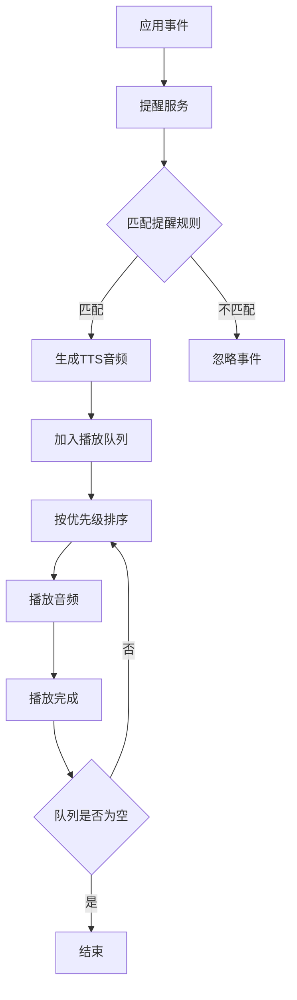
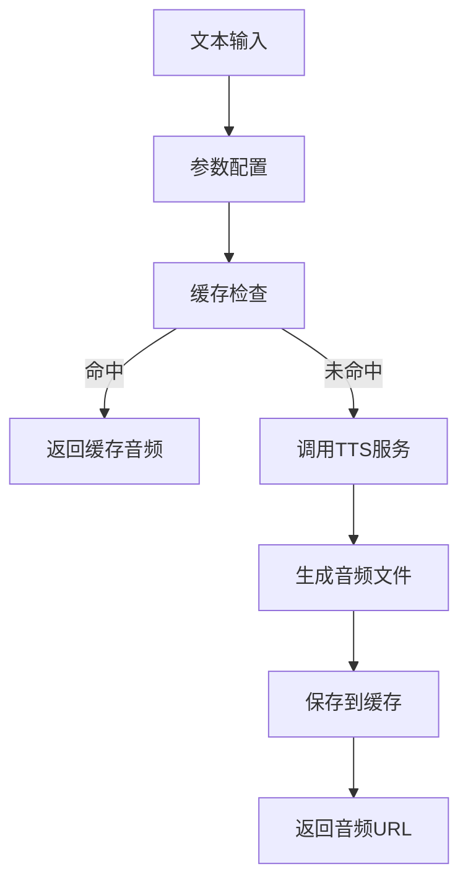

# YYC³ EasyVizAI 有声提醒与音乐播放器功能文档

## 概述

本文档描述了 YYC³ EasyVizAI 有声提醒与音乐播放器功能的架构设计、实现细节和使用指南。

## 系统架构

### 1. 后端架构

#### TTS 服务 (`tts_service.py`)
- **多提供商支持**: 支持 Edge TTS（高质量）和 Google TTS（备用）
- **情感化语音**: 支持 6 种情感色彩（中性、快乐、悲伤、兴奋、平静、紧急）
- **多语言支持**: 中文、英文等多种语言
- **缓存机制**: 智能缓存生成的音频文件，提高响应速度
- **SSML 支持**: 使用 SSML 标记语言实现语音参数精确控制

#### API 端点
- `POST /api/tts/generate/` - 生成 TTS 音频
- `GET /api/tts/voices/` - 获取可用语音选项
- `POST /api/tts/preview/` - 预览语音效果

### 2. 前端架构

#### 音频播放器 (`AudioPlayer.tsx`)
- **多格式支持**: MP3、WAV、OGG 等音频格式
- **高级功能**: 播放列表、随机播放、循环播放、音量控制
- **主题系统**: 云蓝、竹绿、琥珀三种主题风格
- **响应式设计**: 适配不同屏幕尺寸

#### TTS 组件 (`TTSComponent.tsx`)
- **实时转换**: 文本到语音的实时转换
- **参数调节**: 语言、声音类型、情感色彩可调
- **预览功能**: 在线试听不同语音效果
- **集成播放**: 内置音频播放器展示生成结果

#### 语音提醒服务 (`VoiceReminderService.ts`)
- **事件驱动**: 基于应用事件自动触发语音提醒
- **优先级队列**: 支持高、中、低三级优先级
- **智能调度**: 避免语音提醒过于频繁
- **上下文感知**: 根据时间、环境自动调整音量

## 功能特性

### 1. 文本转语音 (TTS)

#### 支持的语音类型
```javascript
const voiceTypes = {
  'zh-CN': {
    female: 'zh-CN-XiaoxiaoNeural',  // 女声
    male: 'zh-CN-YunxiNeural',       // 男声
    child: 'zh-CN-XiaoyiNeural'      // 童声
  },
  'en-US': {
    female: 'en-US-AriaNeural',      // 女声
    male: 'en-US-GuyNeural',         // 男声
    child: 'en-US-JennyNeural'       // 童声
  }
};
```

#### 情感参数配置
```javascript
const emotions = {
  neutral: { speed: 1.0, pitch: 1.0 },    // 中性
  happy: { speed: 1.1, pitch: 1.2 },      // 快乐
  sad: { speed: 0.8, pitch: 0.9 },        // 悲伤
  excited: { speed: 1.3, pitch: 1.3 },    // 兴奋
  calm: { speed: 0.9, pitch: 0.95 },      // 平静
  urgent: { speed: 1.4, pitch: 1.1 }      // 紧急
};
```

### 2. 语音提醒系统

#### 预设提醒事件
- `app.welcome` - 应用欢迎
- `task.completed` - 任务完成
- `task.failed` - 任务失败
- `data.saved` - 数据保存
- `error.occurred` - 错误发生
- `report.ready` - 报告就绪
- `session.timeout_warning` - 会话超时警告

#### 使用示例
```javascript
import { voiceReminderService } from './services/VoiceReminderService';

// 触发预设提醒
await voiceReminderService.triggerReminder({
  type: 'task.completed',
  emotion: 'excited',
  priority: 'medium'
});

// 创建自定义提醒
await voiceReminderService.createAndTriggerCustomReminder(
  '您的数据分析已完成！',
  {
    emotion: 'happy',
    priority: 'high',
    delay: 2000
  }
);
```

### 3. 音频播放器

#### 基本用法
```javascript
import { AudioPlayer } from './components/AudioPlayer';

const playlist = [
  {
    id: 'track1',
    title: '欢迎音频',
    artist: 'AI助手',
    src: '/audio/welcome.mp3'
  }
];

<AudioPlayer
  playlist={playlist}
  theme="cloud"
  showPlaylist={true}
  onTrackChange={(track) => console.log('当前播放:', track)}
/>
```

#### 高级功能
- **播放模式**: 顺序播放、随机播放、单曲循环
- **音量控制**: 支持静音、音量调节
- **进度控制**: 拖拽调节播放进度
- **播放列表**: 可视化播放队列管理

## 集成工作流

### 1. 有声提醒工作流



### 2. TTS 生成流程



## 配置说明

### 1. Django 设置
```python
# settings.py
TTS_CONFIG = {
    'DEFAULT_LANGUAGE': 'zh-CN',
    'DEFAULT_VOICE': 'zh-CN-XiaoxiaoNeural',
    'SUPPORTED_LANGUAGES': ['zh-CN', 'en-US'],
    'AUDIO_FORMAT': 'mp3',
    'AUDIO_QUALITY': 'medium',
}
```

### 2. 前端配置
```javascript
// 语音提醒服务配置
const reminderService = new VoiceReminderService('/api');

// 音频播放器主题配置
const themes = {
  cloud: { primary: '#4A90E2', secondary: '#E8F4FD' },
  bamboo: { primary: '#7CB342', secondary: '#F1F8E9' },
  amber: { primary: '#FFB300', secondary: '#FFF8E1' }
};
```

## 性能优化

### 1. 缓存策略
- **音频缓存**: 基于文本内容、语音参数的 MD5 哈希缓存
- **预加载**: 常用提醒音频预生成
- **清理机制**: 定期清理过期缓存文件

### 2. 队列管理
- **优先级排序**: 高优先级提醒优先播放
- **防重播**: 避免相同提醒短时间内重复播放
- **音量自适应**: 根据时间段自动调节音量

### 3. 错误处理
- **降级方案**: Edge TTS 失败时自动降级到 Google TTS
- **重试机制**: 网络失败时自动重试
- **用户反馈**: 友好的错误提示信息

## 扩展指南

### 1. 添加新的语音提醒
```javascript
voiceReminderService.addReminder({
  id: 'custom_event',
  text: '自定义提醒文本',
  trigger: 'custom.event',
  emotion: 'neutral',
  priority: 'medium',
  enabled: true
});
```

### 2. 自定义主题
```javascript
const customTheme = {
  primary: '#FF6B6B',
  secondary: '#FFE5E5',
  accent: '#E03E3E'
};
```

### 3. 扩展 TTS 提供商
在 `tts_service.py` 中添加新的 TTS 提供商支持：
```python
async def _generate_with_new_provider(self, text: str, options: dict) -> bytes:
    # 实现新提供商的音频生成逻辑
    pass
```

## 部署说明

### 1. 依赖安装
```bash
# 后端依赖
pip install -r backend/requirements.txt

# 前端依赖
cd frontend && pnpm install
```

### 2. 启动服务
```bash
# 启动后端
cd backend && python manage.py runserver

# 启动前端
cd frontend && pnpm dev
```

### 3. 生产环境配置
- 配置静态文件服务
- 设置音频文件存储路径
- 配置缓存清理任务
- 设置监控和日志

## 最佳实践

### 1. 用户体验
- **音量控制**: 提供全局静音选项
- **个性化**: 允许用户自定义提醒文本
- **环境适应**: 根据使用环境调整音效
- **无障碍**: 支持键盘导航和屏幕阅读器

### 2. 性能考虑
- **异步处理**: TTS 生成使用异步处理
- **资源管理**: 及时释放音频资源
- **网络优化**: 压缩音频文件减少传输时间
- **缓存策略**: 合理设置缓存过期时间

### 3. 安全性
- **输入验证**: 严格验证 TTS 输入文本
- **文件安全**: 限制音频文件访问权限
- **API 限流**: 防止 TTS API 滥用
- **内容过滤**: 过滤不当内容

## 常见问题

### Q1: TTS 生成失败怎么办？
A: 系统会自动尝试备用 TTS 提供商，如果仍然失败，会显示错误提示。

### Q2: 如何调整语音提醒的音量？
A: 系统会根据时间自动调整音量，夜间自动降低音量。

### Q3: 支持哪些音频格式？
A: 主要支持 MP3 格式，播放器兼容 WAV、OGG 等格式。

### Q4: 如何禁用某些语音提醒？
A: 在语音提醒管理界面可以单独启用/禁用特定提醒。

## 技术支持

如有技术问题，请参考：
- [项目文档](../README.md)
- [API 文档](../docs/api/)
- [开发指南](../docs/developer-guide.md)

---

© 2024 YY-Nexus YYC³ EasyVizAI Team